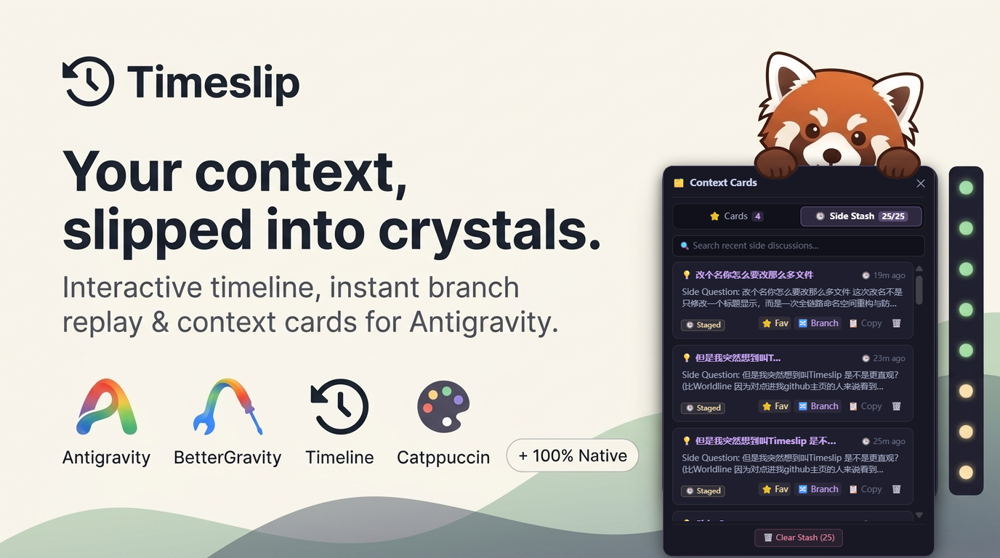

# Timeslip ⏱️


> **Don't lose the thread. Pin it.**  
> *Interactive conversation timeline, branch navigation, trajectory extractor & context cards for Google Antigravity 2.0.*



[](https://deepmind.google/technologies/gemini/)
[](https://github.com/YashjitPal/BetterGravity)
[](https://github.com/RedPanda-Craft)
[](https://github.com/RedPanda-Craft/antigravity-timeslip)
[](LICENSE)

---

## 🌟 Overview

Long conversational programming trajectories with AI agents often result in severe cognitive drag: losing context across dozens of turns, struggling to pinpoint when critical decisions were made, or losing valuable side insights when compaction occurs.

**Timeslip** is a lightweight, zero-dependency native plugin for BetterGravity on Google Antigravity 2.0. It bridges trajectory navigation with persistent memory:
- **Interactive Timeline Rail**: Discrete turn nodes anchored to your chat edge with real-time health tiers and bidirectional scroll-spy.
- **Context Cards Vault**: Capture ephemeral side questions and code snippets with one click, inject them back into your composer via React Fiber reflection.
- **Trajectory Extractor**: Filter queries, responses, thinking traces, and tool outputs with surgical precision. Export to clean Markdown, JSON, or promote to Context Cards.
- **Unified Cockpit HUD**: A single, elegant 32px circular history clock harmonized with Catppuccin Turbo, providing instant launch and interface toggles.
- **First-Run Onboarding**: Native header callout bubbles for first-time users with zero titlebar drag interference.

---

## 🎯 Key Pillars

### 1. ⏱️ Trajectory Navigation (Timeline Rail)
- **Bidirectional Scroll-Spy**: The active turn node illuminates automatically as you scroll through long conversations.
- **Context Health Tiers**: Color-coded turn pacing indicators (Green `< 9` turns, Yellow `< 19`, Orange `< 36`, Red `36+`).
- **Titlebar Telemetry Capsule**: Real-time header pill (`● 18 turns · 0 comp · 4C`) tracking turn depth, compaction events, and chunk payload scale.
- **Smart Virtual Relay Jump**: Deep jumps directly to TanStack virtualized turns with closed-loop convergence verification and gesture-cancel locks.

### 2. 🗂️ Context Cards Vault
- **One-Pin Capture**: Instantly pin side queries, architectural notes, and prompt fragments.
- **React Fiber Hook Injection**: Seamlessly prepends saved card context into your active chat composer.
- **Tags & Search**: Search and filter cards by tags (`#context`, `#architecture`, `#prompt`).

### 3. 📥 Surgical Trajectory Extractor
- **Turn Multi-Select**: Cherry-pick specific turn ranges or toggle entire conversations.
- **Granular Filter Toggles**: Toggle User queries, Assistant responses, Code blocks, Thinking traces, or Tool executions.
- **Multi-Target Export**: Export publication-grade Markdown files, structured JSON datasets, or elevate selected turns directly into Context Cards.

### 4. 🎛️ Unified Cockpit HUD
- **Zero Titlebar Clutter**: Replaces multiple disconnected buttons with a single 32px history clock icon.
- **Display Toggles**: Instant switches to show/hide the Timeline Rail, Telemetry Capsule, or Extract Pill.
- **Catppuccin Mocha Integration**: Built with pure solid-alpha blending and zero GPU blur to prevent viewport stutter.

---

## 🚀 Quick Start & Installation

### Option 1: Git Clone (Recommended)

Clone directly into your BetterGravity plugins directory:

```bash
git clone https://github.com/RedPanda-Craft/antigravity-timeslip.git "%APPDATA%\BetterGravity\plugins\antigravity-timeslip"
```

### Option 2: Manual Installation

1. Download or clone this repository.
2. Place the `antigravity-timeslip` folder inside:
   - **Windows**: `%APPDATA%\BetterGravity\plugins\`
3. Open `%APPDATA%\BetterGravity\settings.json` and ensure `"antigravity-timeslip"` is in the `"enabled"` list:
   ```json
   {
     "plugins": {
       "enabled": [
         "catppuccin-accent",
         "antigravity-timeslip"
       ]
     }
   }
   ```
4. Antigravity will hot-reload instantly. Click the history clock icon `⏱️` in your titlebar to open Cockpit!

---

## 🏗️ Architecture & Constitution Compliance

Timeslip is strictly built according to the **Antigravity Workspace Constitution**:
- **Zero Reflow & GPU Defense**: Reads targeted `textContent` instead of `innerText`. Floating overlays declare zero `backdrop-filter: blur()`.
- **Virtual Mount Convergence**: Uses RAF loops with arrival verification rather than brittle static `setTimeout`.
- **Zero-Patching Fiber Reflection**: Safely walks the React Fiber tree (`memoizedProps` / `dependencies`) to locate host services without regex patching `/main.js`.
- **Modular Decoupling (< 2,000 Lines Baseline)**:

| Module | Purpose |
| :--- | :--- |
| `src/main.js` | Lifecycle orchestration, typing guards, TitleBar DOM observer |
| `src/core/reflection.js` | React Fiber discovery, store reflection, settings persistence |
| `src/core/turnStore.js` | Trajectory harvesting & 300ms debounced storage sync |
| `src/features/timeline/cockpit.js` | Timeslip TitleBar button, onboarding callout & Cockpit popover HUD |
| `src/features/timeline/health.js` | Pure display health gauge & compaction evaluation |
| `src/features/timeline/rail.js` | Timeline rail DOM, scroll-spy, convergence jump loop |
| `src/features/timeline/etaLedger.js` | P50/P90 delay tracking & safe React status badge |
| `src/features/extractor/exporter.js` | Markdown & JSON trajectory serialization |
| `src/features/extractor/modal.js` | Extraction modal with direct 'Save as Cards' trigger |
| `src/features/cards/cardStore.js` | Cards state, disk persistence, sanitization, tag collection |
| `src/features/cards/cardPopover.js` | Floating cards HUD, search, composer capsule injection |
| `styles/timeline.css` | Zero-blur solid alpha stylesheets for rail, cockpit, modal & cards |
| `build.js` | Native zero-dependency builder compiling `src/` to `index.js` |

---

## 📄 License

Released under the [MIT License](LICENSE).  
Crafted with precision by **[RedPanda-Craft](https://github.com/RedPanda-Craft)**.
